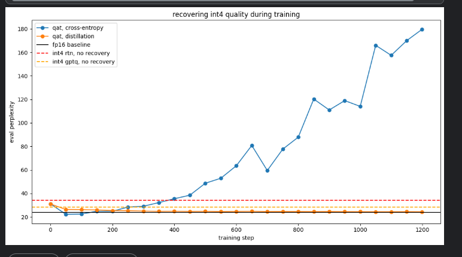
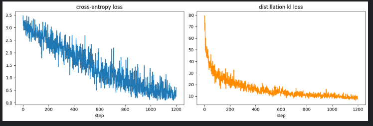
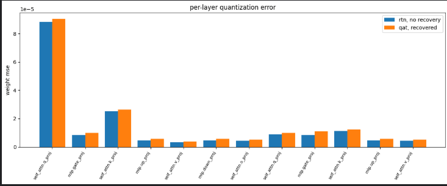
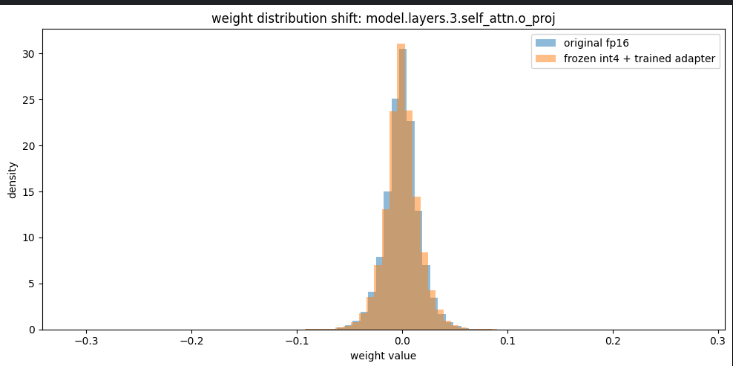
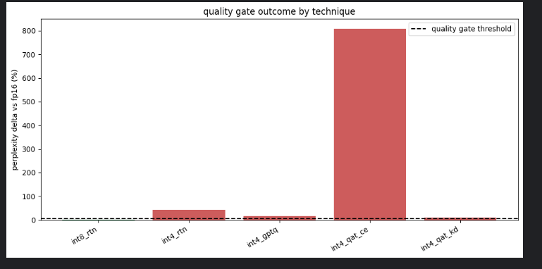
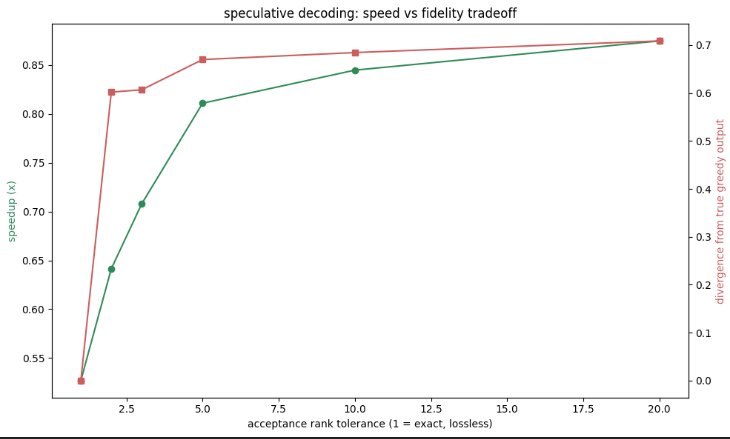
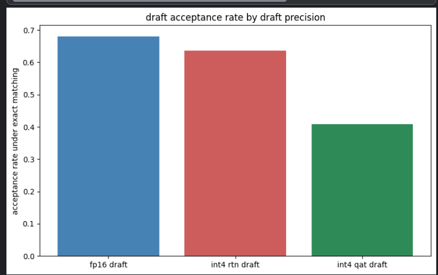

# quantization recovery and speculative decoding

Two research pillars built on quantization harness for Qwen2.5-0.5B, run on Kaggle T4x2.

**Pillar 1** —PTQ @ 4 bits fails a quality gate. Can a frozen quantized model plus a small trainable low-rank adapter (LoRA) recover the lost quality, and does the training objective (cross-entropy vs. distillation) matter?

**Pillar 2** — speculative decoding - what happens to output fidelity and does a draft model's own quantization level change how often it gets accepted?

## Setup

- Model: `Qwen/Qwen2.5-0.5B` (target for Pillar 2: `Qwen/Qwen2.5-1.5B`)
- Hardware: Kaggle T4x2, both GPUs used concurrently for training
- Calibration/eval data: WikiText-2
- Recovery method: weights quantized once via RTN and frozen permanently; only a rank-8 LoRA adapter ( round 3% of total parameters) is trained
- Distillation loss compares only the teacher's top-100 tokens, not the full 151,936-token vocabulary, to keep memory bounded

## Pillar 1: does recovery work?

Two recovery runs, same steps, same data and same starting checkpoint. **Cross-entropy diverges** — perplexity climbs from nearbaseline to 180 by step 1200, ending up worse than the plain version, but **distillation stays stable** the whole run, landing at +10.7% — better than plain RTN (+42.9%) and GPTQ (+17.8%), though still short of the 5% gate.

Both losses decrease smoothly — the CE run's divergence isn't visible in its own training loss, only in held-out perplexity. Classic overfitting signature: with only 400 unique training blocks and a learning rate tuned for LoRA's zero-initialized matrices, cross-entropy training memorized the training set at the cost of general next-token prediction. Distillation's soft-target objective acted as a regularizer against exactly this.

Per-layer MSE, RTN vs the CE-recovered adapter — the "recovered*" bars are consistently higher than plain RTN - so the adapter moved weights in the wrong direction instead of correcting for quantization error.

Raw weight values barely shifted despite behavioral change above — the learning here was that small, low-rank, compounding shifts across 24 layers can break a model's behavior without producing a visibly different weight histogram.

Final scoreboard against the 5% quality gate. Only int8 RTN passes. Distillation is the clear runner-up; cross-entropy is worse than not recovering at all.

**Learning:** recovery training is not automatically safe, as the objective and learning rate matter more than the fact that some training is happening. Distillation's regularizing effect on a small, low-rank adapter looks good for this setup.

## Pillar 2: is speculative decoding lossless?

Exact top-1 acceptance (tolerance = 1) reproduced greedy decoding byte-for-byte across every test prompt — losslessness holds, checked directly rather than assumed. Divergence jumps from 0 to 0.60 the instant tolerance moves from 1 to 2. For this model pair there is no safe middle ground between exactly lossless and majority-diverged.

Under exact matching, the fp16 draft is accepted 68% of the time — realistic number for a same-family 0.5B/1.5B pair. The RTN-int4 draft holds up reasonably (64%); the CE-recovered draft dipts to 41%, the same overfitting damage from Pillar 1 surfacing here as a worse guesser.

**speedup numbers:** neither the baseline nor the speculative decoder in this notebook uses KV-caching — every step reprocesses the full sequence from scratch for both paths, so the measured tok/s-style "speedup" is not representative of a production implementation - you can trust me to use this then, as there is no point wasting wall-clock time :)

